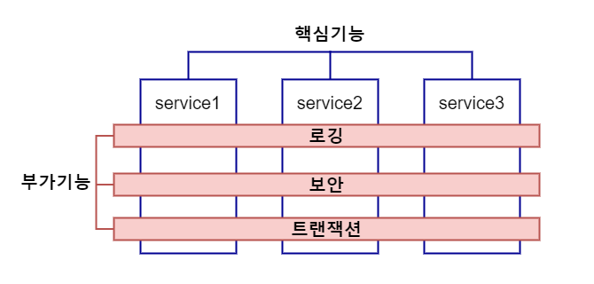
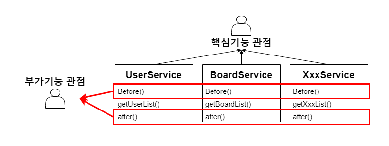
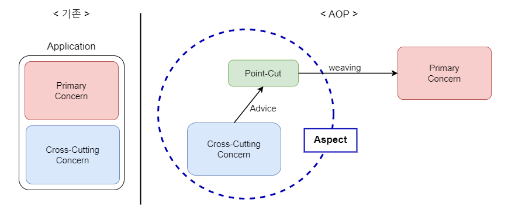

---
meta:
  - name: description
    content: Spring AOP란 무엇인가

tags: ['Spring']
---
# AOP란 무엇인가

## AOP란

- Aspect Oriented Programming, 관점 지향 프로그래밍
- 핵심기능(Core Concerns)에서 부가기능(Cross-cutting Concerns)을 분리해서 모듈화하는 프로그래밍 기법
    
    
    
    
    

## AOP 관련 용어

- 핵심기능 : Core Concern(Primary Concern), 비즈니스 로직을 구현한 부분
- 부가기능 : Cross-cutting Concern, 보안/인증/로그 등과 같이 시스템 전반에 산재되어 사용하는 기능, Advice 라고 하기도 함
- Point-cut : 부가기능을 어디에 끼워넣는지에 대한 위치정보가 들어있는 문법
- weaving : runtime시에 부가기능을 핵심기능에 끼워넣는 것
- Aspect : Cross-cutting Concern + Point-cut, 스프링에서는 Advisor라고 하기도 함

<TagLinks />